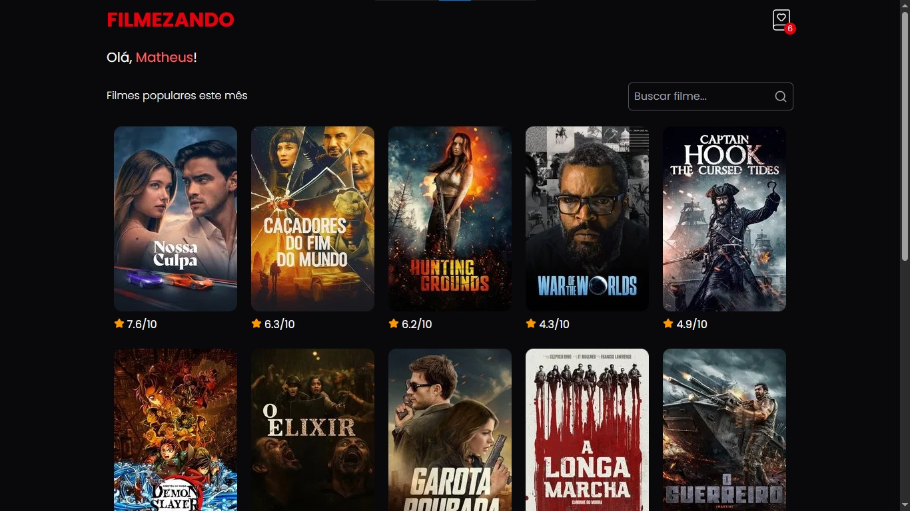
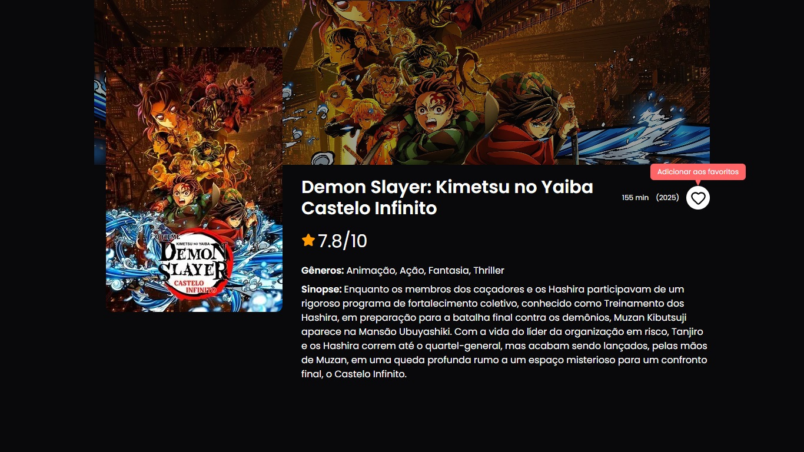
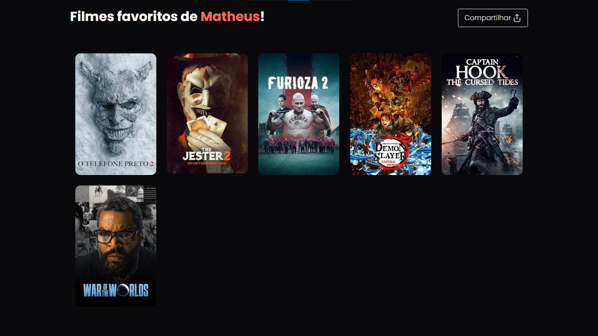
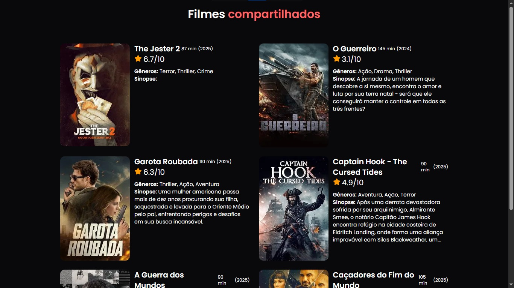
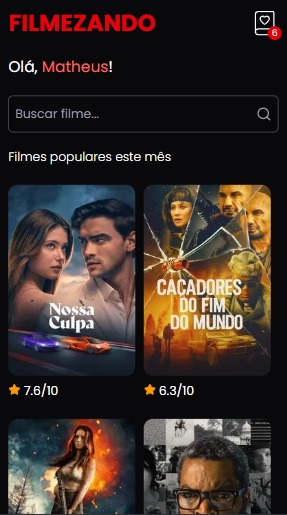
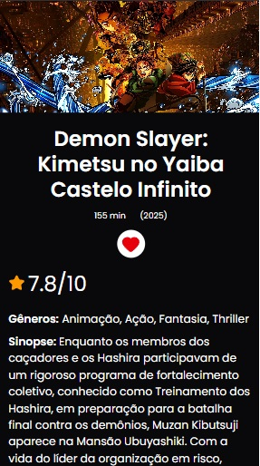

# Desafio Elite Dev - Lista de Filmes (TMDB)

Este é um projeto full-stack desenvolvido como parte do Desafio Elite Dev. A aplicação permite que os usuários pesquisem filmes, salvem seus favoritos em uma lista pessoal e gerem um link público para compartilhar suas listas com outras pessoas.

## 🚀 Links (Deploy)

- **Aplicação (Front-End):** **https://desafio-elite-dev.vercel.app**
- **API (Back-End):** **https://desafio-elite-dev-backend.onrender.com**

## ✨ Funcionalidades

- **Busca de Filmes:** Integração com a API do TMDb para busca de filmes populares (com paginação) e por termo.
- **Lista de Favoritos:** O usuário pode adicionar e remover filmes de uma lista de favoritos.
- **Compartilhamento de Lista:** Geração de um link público e único (`/share/:id`) que exibe um "snapshot" dos favoritos do usuário no momento da criação.

## 🛠️ Tecnologias Utilizadas

Este projeto utiliza uma arquitetura de monorepo com serviços desacoplados:

**Front-End (Servido pelo Vercel):**

- **React** (com Vite)
- **TypeScript**
- **Tailwind CSS** (Estilização)
- **React Router DOM** (Roteamento de páginas)
- **Zustand** (Gerenciamento de estado global, como o `userId`)
- **TanStack Query (React Query)** (Gerenciamento de estado assíncrono, cache e paginação)
- **Axios** (Requisições HTTP)

**Back-End (Servido pelo Render):**

- **Node.js**
- **Express** (Framework da API)
- **TypeScript**
- **Prisma** (ORM para comunicação com o banco de dados)
- **PostgreSQL** (Banco de dados, hospedado no Neon/Render)

**DevOps & Ferramentas:**

- **Docker & Docker Compose** (Ambiente de desenvolvimento local unificado)
- **Swagger (OpenAPI)** (Documentação da API)
- **Postman** (Para testes e validação)

## 🖥️ Como Executar Localmente (Recomendado: Docker)

A forma mais simples de rodar este projeto é utilizando Docker.

**Pré-requisitos:**

- Docker e Docker Compose
- Uma chave de API do TMDb. Você pode gerar uma gratuitamente em: https://www.themoviedb.org/settings/api

**Passos:**

1.  Clone este repositório:

    ```bash
    git clone https://github.com/MatheusGCM/desafio-elite-dev.git
    cd desafio-elite-dev
    ```

2.  Crie uma cópia do arquivo de exemplo `.env.example` e renomeie-a para `.env`:

    ```bash
    cp .env.example .env
    ```

3.  Abra o novo arquivo `.env` (na raiz do projeto) e cole sua chave do TMDb:

    ```
    TMDB_API_KEY=SUA_CHAVE_PESSOAL_DO_TMDB
    ```

4.  Suba os contêineres:

    ```bash
    docker-compose up --build
    ```

    Este comando irá:

    - Construir as imagens do front-end e back-end.
    - Iniciar os três serviços (Front, Back, DB).
    - Executar as migrações do Prisma (`npx prisma migrate deploy`) para criar as tabelas no banco de dados Docker.

5.  Acesse a aplicação no seu navegador:

    - **Front-End:** **http://localhost:5173**
    - **Back-End (API):** **http://localhost:3001**

## 📚 Documentação da API (Swagger)

A documentação completa de todos os endpoints do back-end (rotas, parâmetros, respostas) está disponível via Swagger.

- **Documentação (Local):** **http://localhost:3001/api-docs** (disponível após rodar o `docker-compose up`)
- **Documentação (Produção):** **https://desafio-elite-dev-backend.onrender.com/api-docs**

## 🧠 Desafios do Desenvolvimento (7 Dias)

_(Esta seção é um diário de bordo pessoal sobre os desafios encontrados e as decisões tomadas)_

- O principal desafio foi definir uma arquitetura que fosse, ao mesmo tempo, robusta para o deploy (Vercel/Render/Supabase) e simples o suficiente para facilitar a avaliação local. Comecei o desenvolvimento confiante de que conseguiria entregar tudo dentro do prazo. Mas, no dia 3, as coisas mudaram — tive problemas com o deploy no Render por conta do Supabase. Tentei ao máximo fazer os dois se entenderem, mas sem sucesso. Depois de insistir bastante (e perder um bom tempo com isso), decidi trocar o Supabase pelo Neon — e me perguntei por que não fiz isso antes 😅. Na primeira tentativa, tudo funcionou perfeitamente.

###

- Com esse contratempo, precisei correr atrás do tempo perdido. Depois disso, o desenvolvimento fluiu bem, sem outros problemas à altura. Priorizei as funcionalidades principais e, só depois, os detalhes do front — que é meu ponto forte. Felizmente, já tinha trabalhado com a API do TMDB antes, então muita coisa foi mais tranquila de implementar. A interface também seguiu uma linha que já usei em outros projetos, e nessas horas as experiências anteriores fazem toda a diferença.

###

- No fim, estou muito satisfeito com o resultado. Foram 7 dias de muita dedicação (e algumas noites sem dormir 😅), mas consegui entregar o máximo dentro do tempo que tinha.

## 📸 Evidências do Aplicativo

### 💻 WEB






### 📱 MOBILE

  

---
